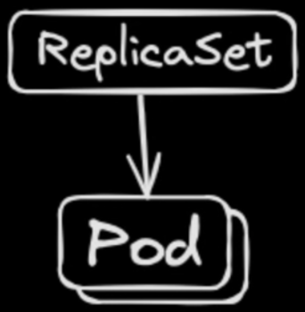

# Common `kubectl` Commands

#### `kubectl` command structure:

```bash
kubectl <VERB> <NOUN> -n <NAMESPACE> -o <FORMAT>
```

---

#### Checking logs:

```bash
kubectl logs <POD_NAME>
kubectl logs deployment/<DEPLOYMENT_NAME>
```

---

#### List pods:

```bash
kubectl get pods -n <NAMESPACE>
kubectl get pods -A # (--all-namespaces)
kubectl get pods -l <KEY>=<VALUE>
```

---

#### Execute commands or debug containers:

```bash
kubectl exec -it <POD_NAME> -c <CONTAINER_NAME> -- bash
kubectl debug -it <POD_NAME> --image=<DEBUG_IMAGE> -- bash
```

---

#### Forward one or more local ports to a pod:

```bash
kubectl port-forward <POD_NAME> <LOCAL_PORT>:<POD_PORT>
kubectl port-forward svc/<DEPLOYMENT_NAME> <LOCAL_PORT>:<POD_PORT>
```

---

#### Describe fields and structure of various resources:

```bash
kubectl explain <NOUN>.path.to.field
```

Examples:

```bash
kubectl explain namespace.metadata
kubectl explain pod.spec.containers.image
```

<br><br>

# Commands used in this section

### Subsection 01 - Pods

Before working with Pods, it's important to understand Namespaces,
which logically isolate groups of resources within a Kubernetes cluster.
Pods, like other resources, are created inside a specific namespace.

Kubernetes includes four initial namespaces:
-  `default` – the default namespace for objects with no other namespace
-  `kube-system` – used for system-level components
-  `kube-node-lease` – stores node lease objects for heartbeat signals
-  `kube-public` – readable by all users, often used for cluster info

By default, namespaces DO NOT act as a network/security boundary.

---

A Pod is the smallest deployable unit in Kubernetes.
It wraps one or more containers that share the same network and storage.
Think of it like a logical host for the application.
But pods are ephemeral — if a node crashes, the pod is gone.


A pod can contain multiple containers (e.g. A main container with an Init container and a Sidecar container).


There are plenty of more configurations available:
  - Listening Ports
  - Health Probes
  - Resource requests/limits
  - Security Context
  - Environment variables
  - Volumes
  - DNS Policies

Useful commands:
```bash
kubectl create namespace <NAMESPACE> # Create a namespace.
kubectl get namespaces               # Get all namespaces.
kubectl get ns                       # Get all namespaces. (Shortened)

kubectl get pods                     # Get pods from the active namespace.
kubectl get pods -n <NAMESPACE> pods # Get pods from the given namespace.

kubectl apply -f <CONFIG_FILE.yaml>  # Apply a configuration to a resource.
```

Run the following:
```bash
kubectl apply -f 01-pod-namespace.yaml && kubens 02--pod # Create a namespace for the Pods and switch to it.
kubectl apply -f 01-pod-nginx-minimal.yaml               # Create a Pod with a minimal NGINX config.
kubectl apply -f 01-pod-nginx.yaml                       # Create a Pod with a proper NGINX config.

kubectl get pods -n 02--pod                              # Get running Pods.

kubectl port-forward nginx-minimal 8080:80               # Port forward the nginx-minimal deployment to the host.
kubectl port-forward nginx 8080:8080                     # Port forward the nginx deployment to the host.
```

Now navigate to http://127.0.0.1:8080/

---

### Subsection 02 - ReplicaSets

A ReplicaSet ensures a specified number of pod replicas are running at any given time.
If a pod dies, the ReplicaSet spins up a new one. But it doesn’t manage updates.

**Labels** are the link between ReplicaSets and Pods.



Useful commands:
```bash
kubectl get replicasets # Get replicaSets from the active namespace.
kubectl get rs          # Get replicaSets from the active namespace (shortened).
```

Run the following:
```bash
kubectl apply -f 02-replicaSet-namespace.yaml && kubens 02--replicaset # Create a namespace for the replicaSets and switch to it.
kubectl apply -f 02-replicaSet-nginx-minimal.yaml                      # Minimal replicaSet.
kubectl apply -f 02-replicaSet-nginx.yaml                              # replicaSet with unprivileged user (more secure).
```

**Bonus**: Delete a pod and observe how it automatically spins up again to match the number of replicas defined.
```bash
kubectl delete pod <POD_NAME>
kubectl get pods
```

---

### Subsection 03 - Deployments

A Deployment manages ReplicaSets and handles updates, rollbacks, and scaling.
It’s the most common way to declare applications in Kubernetes.
Used for long-running stateless applications.


Useful Commands:
```bash
kubectl get deployments       # Get Deployments in the current namespace.
kubectl get deployments.apps  # Explicitly get Deployments in the current namespace from the apps group.

kubectl rollout restart deployment <DEPLOYMENT_NAME> # Apply a restart.
kubectl rollout status deployment <DEPLOYMENT_NAME>  # Check the deployment status.
kubectl rollout undo deployment <DEPLOYMENT_NAME>    # Issue a rollback (if needed).
```

Run the following:
```bash
# Create a namespace for the Deployments and switch to it.
kubectl apply -f 03-deployment-namespace.yaml && kubens 02--deployment
# Deployment with unprivileged user (more secure).
kubectl apply -f 03-deployment-nginx.yaml                              

# Trigger a new rollout and monitor it every 1 second. What do you see?
kubectl rollout restart deployment nginx && watch -n 1 kubectl get pods
# Check Deployment status
kubectl get deployments
# Confirm if deployment is successfully rolled out.
kubectl rollout status deployment nginx
# Check ReplicaSets. A new ReplicaSet is there and the previous one is kept in case of a rollback.
kubectl get rs
# Rollback the deployment and monitor the changes.
kubectl rollout undo deployment nginx
```

**Bonus**: Apply the [nginx-minimal](./03-deployment-nginx-minimal.yaml) deployment, change the NGINX version in it and re-apply the file. What do you see?

---

### Subsection 04 - Services

A Service acts as an internal load balancer across replicas.
It uses pod labels to determine which pods to serve.

Types:
- `ClusterIP`: Internal to cluster.
- `NodePort`: Listens on each node in cluster.
- `LoadBalancer`: Provisions external load balancer.


Useful Commands:
```bash
kubectl get services # Get services in the current namespace.
kubectl get svc      # Get services in the current namespace (shortened).
```

Run the following:
```bash
# Create a namespace for the Services and switch to it.
kubectl apply -f 04-service-namespace.yaml && kubens 02--service
# Apply the Deployment.
kubectl apply -f 04-service-deployment.yaml
# Apply the ClusterIP.
kubectl apply -f 04-service-nginx-clusterIP.yaml
# Apply the LoadBalancer.
kubectl apply -f 04-service-nginx-loadBalancer.yaml
# Apply the NodePort.
kubectl apply -f 04-service-nginx-nodePort.yaml
```

> ℹ️ **Note:** In a typical Kubernetes setup, a cloud provider (e.g., AWS, GCP, Azure) is required to provision public IP
> addresses for services of type `LoadBalancer`. However, when using KinD (Kubernetes in Docker) locally, there is no
> built-in cloud provider to handle this. To simulate a public IP and allow services  to function locally, you can use the
> [cloud-provider-kind](https://github.com/kubernetes-sigs/cloud-provider-kind) project. It acts as a lightweight mock
> cloud provider for kind clusters.

Run the `./.bin/cloud-provider-kind` command (make sure you are at the root level of this repository).
It runs a local controller that watches the Kubernetes cluster and simulates assigning external IPs to LoadBalancer services.
Once running, the `cloud-provider-kind` controller will automatically detect when a LoadBalancer service is created and
simulate assigning it a public IP.

Alternatively you can run it in a Docker container:
```bash
# Clone the repository.
git clone https://github.com/kubernetes-sigs/cloud-provider-kind.git
# Run the service.
docker run --rm -d \
  --name cloud-provider-kind \
  --network host \
  -v /var/run/docker.sock:/var/run/docker.sock \
  cloud-provider-kind
```

Now get the "public" IP via the `kubectl get svc` and paste it in a browser!

---

### Subsection 05 - Jobs

Jobs add the concept of tracking completions.
They are used for execution of workloads that run to completion.


Useful Commands:
```bash
kubectl create job <JOB_NAME> # Create a job with the specified name.
kubectl get jobs              # Get jobs in the current namespace.
```

Run the following:
```bash
# Create a namespace for the Services and switch to it.
kubectl apply -f 04-service-namespace.yaml && kubens 02--service
# Apply the Deployment.
kubectl apply -f 04-service-deployment.yaml
# Apply the ClusterIP.
kubectl apply -f 04-service-nginx-clusterIP.yaml
# Apply the LoadBalancer.
kubectl apply -f 04-service-nginx-loadBalancer.yaml
# Apply the NodePort.
kubectl apply -f 04-service-nginx-nodePort.yaml
```

---

### Subsection 06 - CronJobs

Manually trigger the cron job so that it runs immediately.
```bash
kubectl create job --from=cronjob/<CRONJOB_NAME> <JOB_NAME>
```

Example:
```bash
kubectl create job --from=cronjob/cronjob-date manually-triggered
```

---

### Subsection 07 - DaemonSets

Examples get widely defined pods:

kubectl get pods -o wide

Get nodes
kubectl get nodes

---

### Subsection 08 - StatefulSets

Similar to Deployment, except:
- Pods get sticky identity (pod-0, pod-1, ...)
- Each pod mounts separate volumes
- Rollout behavior is ordered

Run the following:
```bash
kubectl apply -f 08-statefulSet-namespace.yaml && kubens 02--statefulset
kubectl apply -f 08-service-nginx-clusterIP.yaml
kubectl apply -f 08-service-nginx-clusterIP-multi.yaml
kubectl apply -f 08-statefulSet-nginx-init-container.yaml

kubectl port-forward nginx-with-init-container-0 8080:80
kubectl port-forward nginx-with-init-container-1 8080:80 # After exiting the previous command.
```

---

### Subsection 09 - ConfigMaps

Run the following:
```bash
kubectl apply -f 09-configMap-namespace.yaml && kubens 02--configmap
kubectl apply -f 09-configMap-keys-file-like.yaml
kubectl apply -f 09-configMap-keys-property-like.yaml
kubectl apply -f 09-configMap-pod.yaml
```

Useful commands:
```bash
kubectl get cm                                           # Get ConfigMaps.
kubectl exec <POD_NAME> -c <CONTAINER_NAME> -- <COMMAND> # Execute a command in the container.
```

Get contents of the config and print the environment variables in the container:
```bash
kubectl exec nginx-with-configmap -c nginx -- cat /etc/config/config.yaml
kubectl exec nginx-with-configmap -c nginx -- printenv
```

---

### Subsection 10 - Secrets

Similar to ConfigMaps except data is `base64` encoded.
This is to support binary data and is **NOT** a security mechanism.

They are a separate resource type and can be managed/controlled with specific authorization policies.

Run the following:
```bash
kubectl apply -f 10-secret-namespace.yaml && kubens 02--secret
kubectl apply -f 10-secret-string-data.yaml
kubectl apply -f 10-secret-base64-data.yaml
```

Useful commands:
```bash
kubectl get secrets                   # Get all Secrets in the current namespace.
kubectl get secrets -o yaml           # Get all Secrets in YAML format.
kubectl get secret <SECRET_NAME>      # Get a specific Secret by name.
kubectl describe secret <SECRET_NAME> # Describe a specific Secret.

# Decode a specific key from the Secret.
kubectl get secret secret-string-data -o jsonpath='{.data.<SECRET_PATH>}' | base64 --decode
# Decode a specific key from the Secret using yq.
kubectl get secret string-data -o yaml | yq '.data.<SECRET_PATH>' | base64 --decode 
```

> ℹ️ **Note:** Be cautious with how you encode data to base64.
> The `printf` command is often preferred than `echo` for base64 encoding,
> as it avoids issues with trailing newlines that can occur with `echo`.
> Always ensure your data is encoded correctly to avoid unexpected behavior in Kubernetes secrets.

```bash
printf "bar" | base64 # Outputs: YmFy
echo bar | base64 # Outputs: YmFyCg== because it adds a newline character at the end.
```

Now run the following:
```bash
# Apply a Docker config.
kubectl apply -f 10-secret-docker-config-json.yaml

# Automatically creates the correct base64-encoded structure.
# Effectively the same with the above.
kubectl create secret docker-registry docker-config-json \
  --docker-username=admin \
  --docker-password=secret123 \
  --docker-email=admin@example.com \
  --docker-server=https://index.docker.io/v1

# Don’t actually create anything, just show the YAML for later use.
kubectl create secret docker-registry docker-config-json --dry-run=client -o yaml \
  --docker-username=admin \
  --docker-password=secret123 \
  --docker-email=admin@example.com \
  --docker-server=https://index.docker.io/v1
```

Finally, a Pod example with secrets:
```bash
kubectl apply -f 10-pod-with-secret.yaml
kubectl exec pod-with-secret -c nginx -- printenv # Check environment variables.
kubectl exec pod-with-secret -c nginx -- cat /etc/config/token # Check mounted secret file.
```

---

### Subsection 11 - Ingress

Enables routing traffic to many services via a single external LoadBalancer.
Supports layer 7 routing e.g. http(s), but some implementations allow for layer 4 (TCP/UDP) with additional config.
Variety of options: Ingress-nginx, HAProxy, Traefik, Kong, Istio

Run the following:
```bash
kubectl apply -f 11-ingress-namespace.yaml && kubens 02--ingress

# Install the official ingress-nginx controller in namespace ingress-nginx
kubectl apply -f https://raw.githubusercontent.com/kubernetes/ingress-nginx/controller-v1.10.1/deploy/static/provider/kind/deploy.yaml

# Cluster nodes don’t have the default node affinity for ingress-nginx.
# Patch the controller to schedule on all nodes.
kubectl patch deployment ingress-nginx-controller \
  -n ingress-nginx \
  --type='json' \
  -p='[{"op": "remove", "path": "/spec/template/spec/nodeSelector"}]'

# Wait until controller is running, then apply the resources.
kubectl apply -f 11-ingress-deployment.yaml
kubectl apply -f 11-ingress-clusterIP.yaml
kubectl apply -f 11-ingress-nginx-minimal.yaml

# Port forward ingress-nginx controller service to localhost
kubectl port-forward -n ingress-nginx svc/ingress-nginx-controller 8080:80

# Add ingress host to /etc/hosts so browser resolves to localhost
echo "127.0.0.1 ingress-nginx-minimal.example.com" | sudo tee -a /etc/hosts
```

Now access: http://ingress-nginx-minimal.example.com:8080/

---

### Subsection 12 - PersistentVolumes & PersistentVolumeClaims

Provides API for creating, managing and consuming storage
that lives beyond the life of an individual pod.

Access Modes:
  - `ReadWriteOnce`: The volume can be mounted as read-write by a single node.
  - `ReadWriteOncePod`: The volume can be mounted as read-write by only one pod at a time — even on the same node.
  - `ReadOnlyMany`: The volume can be mounted read-only by multiple pods across multiple nodes.
  - `ReadWriteMany`: The volume can be mounted as read-write by multiple pods across multiple nodes.

Reclaim Policy: determines what happens to the storage resource after the associated PersistentVolumeClaim (PVC) is deleted (Retain vs Delete).


Run the following:
```bash
kubectl apply -f 12-persistentVolume-namespace.yaml && kubens 02--persistent-volume
kubectl apply -f 12-persistentVolume.yaml
kubectl apply -f 12-persistentVolumeClaim.yaml
kubectl apply -f 12-nginx-pod-with-volume.yaml
```

Useful Commands:
```bash
kubectl get sc  # Get Storage Classes
kubectl get pv  # Get Persistent Volumes
kubectl get pvc # Get Persistent Volume Claims
```

Now test the volumes:
```bash
docker exec -it kind-worker touch /kind-bind-mount/hello-from-host        # Create the file in worker 1 (simulate host).
docker exec -it kind-worker2 touch /kind-bind-mount/hello-from-host       # Create the file in worker 2 (simulate host).
kubectl exec nginx-with-volume -- ls -l /usr/share/nginx                  # Now list the files, host is saying hello!
kubectl exec nginx-with-volume -- touch /usr/share/nginx/hello-from-pod   # Create a file in the pod.
ls -l ../01-kind-cluster-config/kind-bind-mount-{1,2}                     # Pod is saying hello!
```

> ℹ️ **Note:** A PVC binds to only one matching PV — the first eligible one.

---

#### Delete namespace(s) (for cleanup):

```bash
kubectl delete namespace <NAMESPACE>
kubectl delete -f <file>
```

From tasks:

```bash
task 07-delete-namespaces
```

